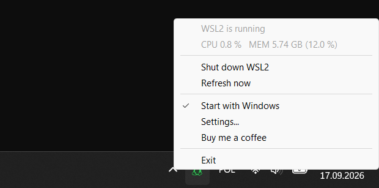

# wsl-tray

[](https://github.com/ideaconnect/wsl-tray/actions/workflows/build.yml)
[](https://github.com/ideaconnect/wsl-tray/releases)
[](https://github.com/ideaconnect/made-in-the-eu)

Windows tray icon that shows whether the WSL2 VM is running and how much CPU
and memory it uses, with a menu entry that shuts it down.


It sits next to the clock like the keyboard-layout badge. Grey means the WSL2
VM is off; green, orange or red means it is running and shows how much of the
machine it is using.


Left to right: off, running below 50 %, 50–75 %, above 75 %.

Percentages are relative to the whole machine (all logical cores, all physical
RAM), the same way Task Manager reports `vmmemWSL`. The colour follows whichever
of CPU or memory is higher.

Hover for the numbers:


Click (left or right) for the menu:



**Shut down WSL2** runs `wsl --shutdown` after asking for confirmation.
**Start with Windows** adds or removes an entry under
`HKCU\Software\Microsoft\Windows\CurrentVersion\Run`.

## Download

<p align="center">
  <a href="https://github.com/ideaconnect/wsl-tray/releases/latest/download/wsl-tray-win11-x64.exe"></a>
  &nbsp;&nbsp;
  <a href="https://github.com/ideaconnect/wsl-tray/releases/latest/download/wsl-tray-win11-arm64.exe"></a>
</p>
<p align="center">
  <a href="https://github.com/ideaconnect/wsl-tray/releases/latest/download/wsl-tray-win10-x64.exe"></a>
  &nbsp;&nbsp;
  <a href="https://github.com/ideaconnect/wsl-tray/releases/latest/download/wsl-tray-win10-arm64.exe"></a>
</p>

The buttons always fetch the latest release. Each
[release](https://github.com/ideaconnect/wsl-tray/releases) has four
executables attached, `wsl-tray-win11-x64.exe`, `wsl-tray-win11-arm64.exe`,
`wsl-tray-win10-x64.exe` and `wsl-tray-win10-arm64.exe`, with a `SHA256SUMS`
file. There is nothing to install: put the file somewhere permanent, run it,
and tick **Start with Windows** in the menu if you want it back after a
reboot. It does not need administrator rights.

The Windows 11 and Windows 10 builds differ in one thing only: the name of
the VM process they look for, `vmmemWSL` or `vmmem`. If the icon stays grey
while a distribution is running, look the process up in Task Manager
(Details tab) and take the other build, or pass the name with `-process`.

On Windows 11 the icon shows up next to the clock on first run (the app sets
its own `IsPromoted` flag in `HKCU\Control Panel\NotifyIconSettings`, but only
if you have not already decided about it in Settings › Taskbar).

## Sponsoring

If wsl-tray is useful to you, you can support its development:

<p align="center">
  <a href="https://github.com/sponsors/ideaconnect"></a>
  &nbsp;&nbsp;
  <a href="https://buymeacoffee.com/idct"></a>
</p>

## Command line

```
wsl-tray.exe [-poll 5s] [-interval 30s] [-process vmmemWSL] [-log FILE] [-render-test DIR]
```

| Flag | Default | Meaning |
|---|---|---|
| `-poll` | `5s` | How often to check whether the VM process exists. Cheap. |
| `-interval` | `30s` | How often to refresh CPU and memory while the VM is running. |
| `-process` | `vmmemWSL` (Windows 11 build), `vmmem` (Windows 10 build) | Name of the VM process. |
| `-log` | – | Append one line per poll and menu action to this file. |
| `-render-test` | – | Write the icon in every state and size as PNGs to this directory, then exit. |

Flags follow Go conventions: `-poll 10s`, `-poll=10s` and `--poll 10s` all
work. Durations are written like `30s`, `1m30s` or `250ms`.

## Resource usage

Measured on Windows 11 25H2, AMD Ryzen AI MAX+ 395 (32 logical cores, 48 GB),
125 % display scaling, with the release build from this repository.

| | |
|---|---|
| Executable | 282 KB (x64), 270 KB (ARM64) |
| Private memory | 2.5 MB at start, 3.9 MB after half an hour |
| Working set | 10 MB at start, ~19 MB once the menu and tooltip have been shown (shared theme and common-control DLLs) |
| Threads | 1 while idle; up to 3 more appear briefly for GDI and the thread pool, and one runs `wsl --shutdown` |
| One presence check | 3.8 ms for a full process-list snapshot (~250 processes) |
| Idle CPU | 1.1 ms of CPU per second over a 23-minute window with the VM running (0.11 % of one core, 0.003 % of the machine) |

The only dependency is [`windows-sys`](https://crates.io/crates/windows-sys),
which contains nothing but `extern` declarations. There is no runtime, no COM,
no allocation on the poll path beyond reusing one buffer.

For comparison, the [original Go version](https://github.com/ideaconnect/wsl-tray/tree/80832856e8e4c4db82938dd60d8245e506c6db0a/legacy/go)
of this program was a 2.4 MB executable using 16 MB of private memory and 8
threads; the difference is the Go runtime.

Measure it yourself: `cargo test --release -- --ignored --nocapture poll_cost`
prints the per-poll cost on your machine.

## How it works

- The VM shows up as a process called `vmmemWSL` (`vmmem` on Windows 10). Its
  presence is the on/off signal. `wsl --list --running` is not used because
  it says "no running distributions" while the VM is still alive and holding
  memory.
- CPU and memory come from `NtQuerySystemInformation(SystemProcessInformation)`,
  the call Task Manager uses. It needs no handle to the process, which matters
  because `vmmemWSL` runs as SYSTEM and `OpenProcess` on it is denied to a
  normal user. CPU is the difference in kernel+user time between two samples
  divided by wall time and the number of logical cores; memory is the
  process's working set.
- The icon is the Font Awesome "linux" glyph, rasterized once into a small
  coverage mask (`assets/tux.bin`, generated by `tools/gentux-rs`) and scaled
  to the taskbar's icon size at run time. No font is involved, so it looks the
  same on every machine.
- `wsl --shutdown` is started with `CreateProcessW` and an explicit
  `System32\wsl.exe` path, without a console window.

## Building

You need a stable Rust toolchain (1.88 or newer) with the MSVC target.

```powershell
.\build.ps1
```

This runs `cargo build --release` and copies the result to `.\wsl-tray.exe`.
Run that copy rather than the one under `target\`: Windows refuses to
overwrite a running executable, so running from `target\release` makes the
next build fail while the tray app is open.

`.\build.ps1 -Win10` (or `cargo build --release --features win10`) builds the
Windows 10 variant. The `win10` feature does nothing but change the default of
`-process` from `vmmemWSL` to `vmmem`.

The exe icon, the application manifest (per-monitor DPI, common controls v6)
and the version resource are linked from pre-built objects in `res\` (one per
architecture), so `rc.exe` is not needed. To regenerate them after editing
`winres\`:

```powershell
go install github.com/tc-hib/go-winres@latest
go-winres make --in winres/winres.json --arch amd64,arm64 --out res/wsl-tray
Move-Item res\wsl-tray_windows_amd64.syso res\wsl-tray-amd64.res.obj -Force
Move-Item res\wsl-tray_windows_arm64.syso res\wsl-tray-arm64.res.obj -Force
```

To regenerate the icon mask after changing `tools\gentux-rs\linux.svg` or the
stroke width:

```powershell
cd tools\gentux-rs
cargo run --release
```

### Tests and CI

`cargo test --release` runs the unit tests, including one that samples live
processes on the machine. The GitHub Actions workflow builds the Windows 11
and Windows 10 variants for x64 and ARM64 on every push, runs the tests and
clippy, and attaches all four executables to a release when a `v*` tag is
pushed.

### Layout

```
src/main.rs        window, tray icon, menu, autostart, Windows 11 promotion
src/monitor.rs     process sampling, wsl --shutdown
src/icon.rs        mask scaling, HICON creation, PNG output for -render-test
assets/tux.bin     icon mask (generated)
res/               resource objects; winres/ has their sources
tools/gentux-rs/   mask generator
docs/              screenshots
```

Each source file starts with a module comment that explains its part of the
program (the message flow and re-entrancy rules in `main.rs`, why the
process list is read the way it is in `monitor.rs`, the icon pipeline in
`icon.rs`). `cargo doc --document-private-items --open` renders all of it.

## License

BSD 3-Clause, see [LICENSE](LICENSE). The Tux glyph is the "linux" icon from
[Font Awesome Free](https://fontawesome.com), CC BY 4.0; see
[THIRD_PARTY_NOTICES.md](THIRD_PARTY_NOTICES.md).
